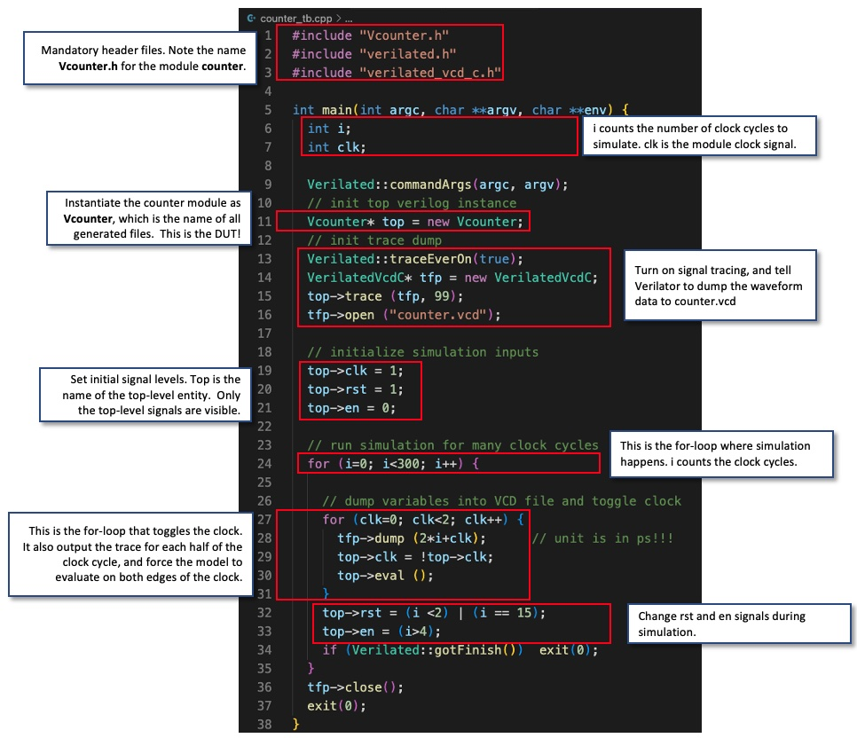

# TASK 1 - Simulating a 8-bit binary counter

## STEP 1 - Implement a 8-bit counter using SystemVerilog

Register Transfer Level (RTL) is a construct used within a Hardware Description and Verification Language (HDL) to design digital integrated circuits. Indeed, RTL abstracts from low-level details and allows for a high-level specification of the combinational logic and sequential circuits needed to implement a particular functionality.

SystemVerilog is the HDL we will be using throughout this course.


A counter is a synchronous device that, for every rising clock edge:
- resets the _count_ variable to 0 whenever _rst = 1_
- increments the _count_ variable by 1 if _en = 1_

The synchronous nature of the counter translates into a delay of one clock cycle between the change in the input and the effect on the output.

The counter's behaviour could then be summarised through the following state-diagram:


The SystemVerilog corresponding algorithm would then be:

``` SystemVerilog
module counter #(
    parameter WIDTH = 8
)(
    // interface signals
    input logic                     clk,    // clock
    input logic                     rst,    // reset
    input logic                     en,     // counter enable
    output logic    [WIDTH-1:0]    count    // count output
);

always_ff @ (posedge clk)
    if (rst)    count <= {WIDTH{1'b0}};
    else        count <= count + {{WIDTH-1{1'b0}}, en};

endmodule 
```

Note that _WIDTH_ is defined as a user-inputted local parameter to the module _counter_. Here, _WIDTH_ is used to specify the number of bits to represent the output _count_.

The _always_ff @ (posedge clk)_ procedure mimics the behaviour of a synchronous D-FlipFlop. Within that procedure, non-blocking assignments _<=_ are used to ensure all modifications are executed simultaneously.

Finally, the clever bit manipulation in _{{WIDTH-1{1'b0}}, en}_ allows for an incrementation of _counter_ when _en = 1_ without resorting to an _if_ statement.

Here is the mapping between the SystemVerilog and the counter circuit synthesized via Verilator:

[^1]


## STEP 2 - Creating a TestBench

The SystemVerilog file _.sv_ is then passed through Verilator. An executable C++ program is then obtained. This program, however, cannot be interacted with; a tester cannot get dynamic real-time feedback. The Device Under Test (DUT) then needs to be prompted through a separate program: the testbench.

The testbench should:
- instantiate the DUT
- provide input signals at specific times
- monitor output signals

The C++ code below is the testbench we were provided with to test our _counter.sv_:

``` C++
#include "Vcounter.h"
#include "verilated.h"
#include "verilated_vcd_c.h"

int main(int argc, char **argv, char **env)
{
    int i;
    int clk;

    Verilated::commandArgs(argc, argv);
    // init top verilog instance
    Vcounter *top = new Vcounter;
    // init trace dump
    Verilated::traceEverOn(true);
    VerilatedVcdC *tfp = new VerilatedVcdC;
    top->trace(tfp, 99);
    tfp->open("counter.vcd");

    // initialize simulation inputs
    top->clk = 1;
    top->rst = 1;
    top->en = 0;

    // run simulation for many clocks cycle

    for (i = 0; i < 300; i++)
    {

        // for dump variables into VCD file and toggle clock
        for (clk = 0; clk < 2; clk++)
        {
            tfp->dump(2 * i + clk); // in picoseconds
            top->clk = !top->clk;
            top->eval();
        }

        top->rst = (i < 2) | (i == 15);
        top->en = (i > 4);

        if (Verilated::gotFinish())
            exit(0);
    }

    tfp->close();
    exit(0);
}
```

This program can be divided up into multiple sections:


[^1]
## STEP 3 - Compiling the SystemVerilog model with the testbench

The following shell script:
1. deletes the previous counter.vcd waveform (if it exists)
2. runs Verilator to translate _counter.sv_ into C++ code
3. creates _Vcounter_, the executable file
4. runs _Vcounter_

``` Shell
#!/bin/sh

# cleanup
rm -rf obj_dir
rm -f counter.vcd

# run Verilator to translate Verilog intro C++, including C++ testbench
verilator -Wall --cc --trace counter.sv --exe counter_tb.cpp

#build C++ project via make automatically generated by Verilator
make -j -C obj_dir/ -f Vcounter.mk Vcounter

#run executable simulation file
obj_dir/Vcounter
```

In the terminal, type _./doit.sh_. A new file, _counter.vcd_, is created.

Accessing that file through _WaveTrace_:


## STEP 4 - Stop counting for 3 cycles once the counter reaches 9

Modifying the testbench _counter_tb.cpp_ so that the counting stops for 3 cycles when _count_ reaches 9:
- Count the number of cycles the stall has lasted through _int stall_
- Add a bool _in_stall_ returning _true_ only if _count = 9_ and _stall < 3_
- Reset the values of both _in_stall_ and _stall_ when counting resumes

``` C++
#include "Vcounter.h"
#include "verilated.h"
#include "verilated_vcd_c.h"

int main(int argc, char **argv, char **env)
{
    int i;
    int clk;

    Verilated::commandArgs(argc, argv);
    // init top verilog instance
    Vcounter *top = new Vcounter;
    // init trace dump
    Verilated::traceEverOn(true);
    VerilatedVcdC *tfp = new VerilatedVcdC;
    top->trace(tfp, 99);
    tfp->open("counter.vcd");

    // initialize simulation inputs
    top->clk = 1;
    top->rst = 1;
    top->en = 0;

    int stall = 0;
    bool in_stall;

    for (i = 0; i < 300; i++)
    {

        // for dump variables into VCD file and toggle clock
        for (clk = 0; clk < 2; clk++)
        {
            tfp->dump(2 * i + clk); // in picoseconds
            top->clk = !top->clk;
            top->eval();
        }

        in_stall = (top->count == 9 && stall < 3); // ensure counting stops for exactly 3 cycles
        top->rst = (i < 2) | (i == 19);
        top->en = (i > 4) && !in_stall;

        stall = in_stall ? stall + 1 : 0;

        if (Verilated::gotFinish())
            exit(0);
    }

    tfp->close();
    exit(0);
}
```


In the terminal, type _./doit.sh_. A new file, _counter.vcd_, is created.

Accessing that file through _WaveTrace_:


## STEP 5 - Implementing an asynchronous Reset

To implement an asynchronous reset, modify the SystemVerilog file _counter.sv_.
The line _always_ff @ (posedge clk)_ becomes _always_ff @ (posedge clk, posedge rst)_.
That way, ----

``` SystemVerilog
module counter #( 
    parameter WIDTH = 8
)(
    // interface signals
    input logic                     clk,    // clock
    input logic                     rst,    // reset
    input logic                     en,     // counter enable
    output logic    [WIDTH-1:0]    count    // count output
);

always_ff @ (posedge clk, posedge rst)
    if (rst)    count <= {WIDTH{1'b0}};
    else        count <= count + {{WIDTH-1{1'b0}}, en};

endmodule 
```


In the terminal, type _./doit.sh_. A new file, _counter.vcd_, is created.

Accessing that file through _WaveTrace_:


[^1]:  Taken from [IACLAB1 github repository](https://github.com/EIE2-IAC-Labs/Lab1-Counter)