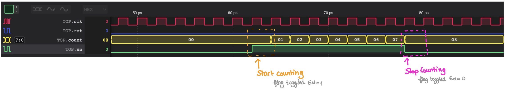
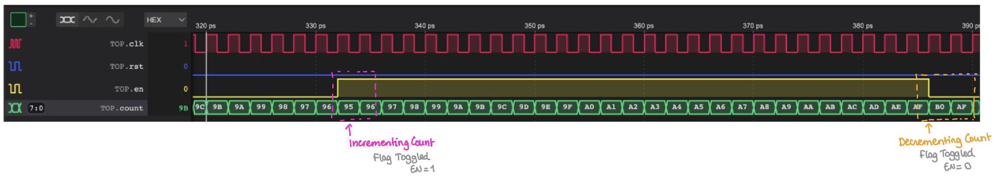

# TASK 2 - Linking Verilator Simulation with Vbuddy

## STEP 1 - Connecting to Vbuddy

Vbuddy offers an interface allowing a tester to interact with the Device Under Test (DTU) through the testbench by providing inputs (through microphone or rotary encoder) and visualizing outputs (headphone jack, TFT Display, LEDs).


[^1]

Run the command `ls /dev/tty.u*` to determine the terminal Vbuddy is connected to.
Paste the value returned by the command to the _vbuddy.cfg_ file

## STEP 2 - Testing the counter through 7-segment displays and plots

For there to be an interactive interface with the DUI, the testbench needs to be modified.

``` C++
#include "Vcounter.h"
#include "verilated.h"
#include "verilated_vcd_c.h"
#include "vbuddy.cpp"

int main(int argc, char **argv, char **env)
{
    int i;
    int clk;

    Verilated::commandArgs(argc, argv);
    // init top verilog instance
    Vcounter *top = new Vcounter;
    // init trace dump
    Verilated::traceEverOn(true);
    VerilatedVcdC *tfp = new VerilatedVcdC;
    top->trace(tfp, 99);
    tfp->open("counter.vcd");

    // init Vbuddy
    if (vbdOpen() != 1)
        return (-1);
    vbdHeader("Lab 1: Counter");

    // initialize simulation inputs
    top->clk = 1;
    top->rst = 1;
    top->en = 0;

    // run simulation for many clocks cycle
    for (i = 0; i < 500; i++)
    {

        // for dump variables into VCD file and toggle clock
        for (clk = 0; clk < 2; clk++)
        {
            tfp->dump(2 * i + clk); // in picoseconds
            top->clk = !top->clk;
            top->eval();
        }

        // ++++ Send count value to Vbuddy
        vbdHex(4, (int(top->count) >> 16) & 0xF);
        vbdHex(3, (int(top->count) >> 8) & 0xF);
        vbdHex(2, (int(top->count) >> 4) & 0xF);
        vbdHex(1, int(top->count) & 0xF);
        vbdCycle(i + 1);
        //  ----

        // change input simulation
        top->rst = (i < 2) | (i == 15);
        top->en = vbdFlag();

        if (Verilated::gotFinish())
            exit(0);
    }

    vbdClose();
    tfp->close();
    exit(0);
}
```

Notice:
- Inputs from Vbuddy's push-button switch are fed into the DUI through the `top->en = vbdFlag()` command
- Output are being displayed in HEX on 7-segment dispalays via Vbuddy's TFT Display through the `vbdHex()` command

Compiling and testing our code:


Vbuddy's flag can be used to enable/disable the counter:




We could also chose to display the output as a graph. For that, use the function `vbdPlot(int(top->count), 0, 255)`:


## STEP 3 - Incrementing and Decrementing through Flag

The _en_ signal could also be used to control the direction of counting:
- `en = 1` for incrementing
- `en = 0` for decrementing


For that, modify the _counter.sv_ file:

``` SystemVerilog
module counter #(
    parameter WIDTH = 8
)(
    // interface signals
    input logic                     clk,    // clock
    input logic                     rst,    // reset
    input logic                     en,     // counter enable
    output logic    [WIDTH-1:0]    count    // count output
);

always_ff @ (posedge clk, posedge rst)
    if (rst)    count <= {WIDTH{1'b0}};
    else        count <= en ? (count + {{WIDTH-1{1'b0}}, 1'b1}) : (count - {{WIDTH-1{1'b0}}, 1'b1});

endmodule
```

Compiling and running the code:

[](https://www.youtube.com/watch?v=W31bzB84tAY)




[^1]: Taken from [IACLAB1 github repository](https://github.com/EIE2-IAC-Labs/Lab1-Counter)

